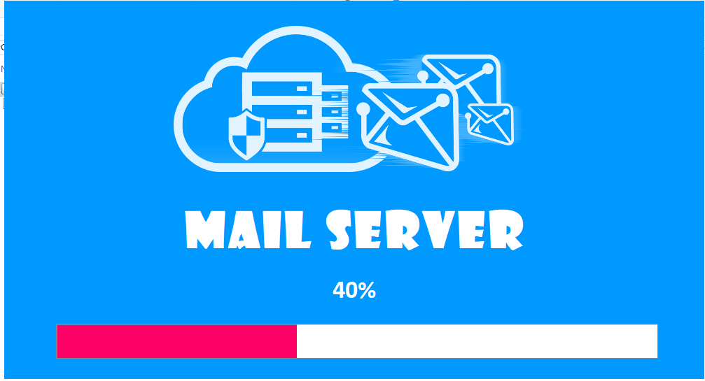
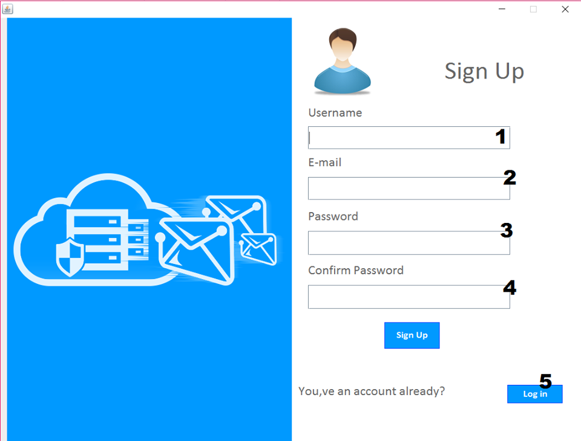
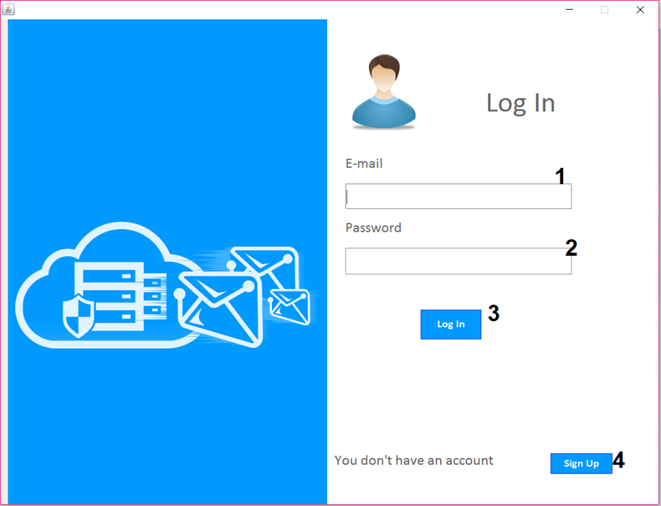
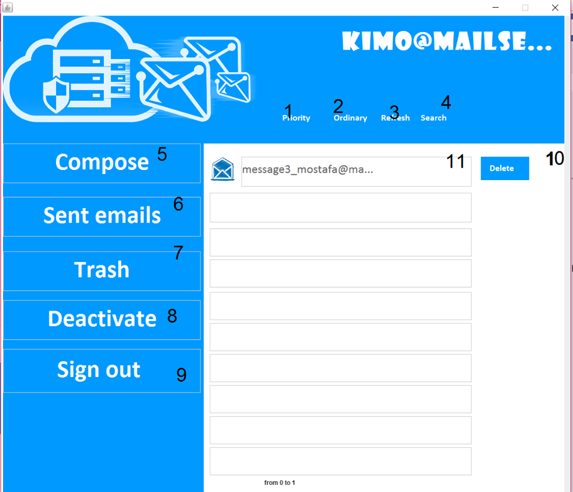
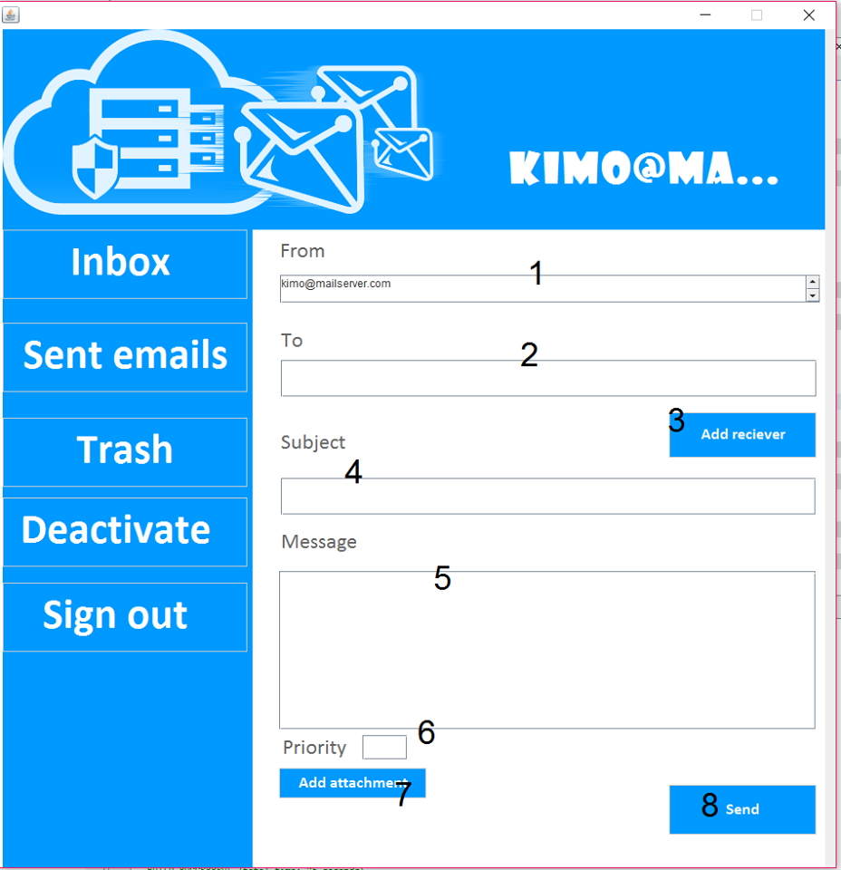
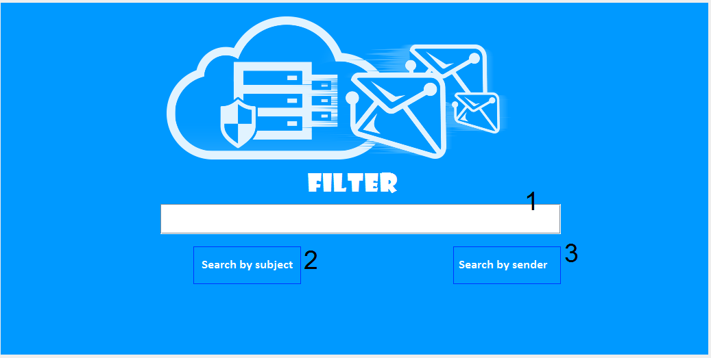

# MailServer
java application mimics gmail features.You can use the features of the program for the first time by signing up, after that you can access your account by logging in.

## Features:
  - graphical user interface.
  - Send messages with text contents or attached files.
  - Deactivate your account if you want.
  - Delete any message or filter the message in your inbox by the subject or the sender.
  - sort the messages by their priority or by date (Default).
  
## User manual:
  - Once the user open the program he will see the shown :
    
      - User inserts his user name.
      - User inserts his e-mail.
      - User inserts his password.
      - User confirms his password.
      - If he already had an account he logs in.

  - When the user chose to log in he will see the shown:
    
      -	User inserts his user e-mail.
      -	User inserts his password.
      -	He can access his account now.
      -	If the user did not have an account yet, he must sign up.
      
   - Once the user do that he can use the features of the program :
    
      -	To order the messages by priority.
      -	To order the messages by date.
      -	To refresh.
      -	To search for any message.
      -	To send a new message.
      -	To open sent emails.
      -	To open trash (deleted emails).
      -	To deactivate the account.
      -	To sign out.
   - To send messages user presses compose, then he will see the shown:
     
      -	Email of the user.
      -	The receivers (user can send the same message to many other users).
      -	 User presses it to add receivers.
      -	User adds the subject of the message.
      -	User writes the text content.
      -	User sets the priority of the message.
      -	User attaches any file to his message.
      -	Finally, user sends the message.
   - If user wants to filter the messages by subject or sender:
      

